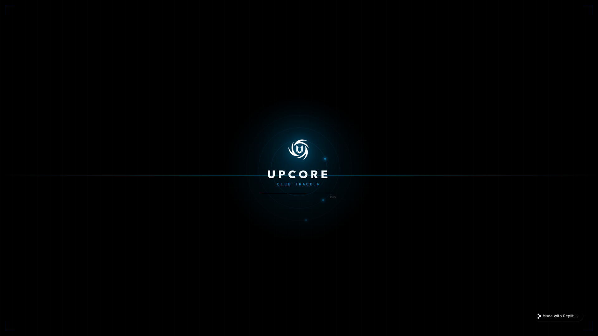

# UPCore Club Tracker

A real-time command-center dashboard for monitoring all 16 UPCore Brawl Stars clubs — tracking member activity, promotions, demotions, joins, and leaves as they happen.



> *Cinematic boot-up screen on first load. Neon scan-line transitions play between every screen.*

---

## Features

- **Live Club Overview** — All 16 clubs on one screen with trophies, member count, online status, Mega Pig stats, and President name
- **Activity Logs** — A searchable, filterable feed of every join, leave, promotion, and demotion event
- **Club Detail Modal** — Click any club card to see the full member roster sorted by trophies
- **Command Center** — Top-level summary of the most recent events across all clubs
- **System Settings** — Add or remove clubs, enable/disable logging per club with instant validation
- **Cinematic Navigation** — Neon scan-line transition animation between every screen
- **Auto-refresh** — Clubs auto-refresh every 5 minutes; loading clubs retry every 5 seconds until all are populated

---

## Tech Stack

| Layer | Technology |
|---|---|
| Frontend | React 19, Vite, Tailwind CSS v4, Framer Motion, Wouter |
| Backend | Node.js, Express, Pino logger |
| Database | MongoDB Atlas |
| API | Brawl Stars Official API (polled every 5 min) |
| Type safety | Zod, TypeScript |
| Monorepo | pnpm workspaces |

---

## Project Structure

```
/
├── upcore-tracker/          # React + Vite frontend
│   ├── public/              # Static assets (logo, favicon)
│   └── src/
│       ├── pages/           # home, logs, overview, settings, about
│       ├── components/      # Layout, ScanOverlay, PageWrapper, SplashScreen
│       ├── api/             # Generated TanStack Query hooks
│       └── index.css        # Global theme tokens + animation keyframes
│
└── api-server/              # Express API + background poller
    └── src/
        ├── routes/          # clubs.ts, logs.ts, health.ts
        ├── services/        # brawlstars.ts, poller.ts
        ├── db/              # MongoDB connection
        └── lib/             # logger.ts
```

---

## Quick Start (Local)

```bash
# 1. Clone and install
git clone <your-repo-url>
cd upcore-club-tracker
pnpm install

# 2. Set environment variables (see INSTALLATION_GUIDE.md)
export MONGODB_URI="mongodb+srv://..."
export BRAWL_STARS_API_KEY="your-key"

# 3. Start the API server
PORT=8080 pnpm --filter @workspace/api-server run dev

# 4. Start the frontend (separate terminal)
PORT=5173 pnpm --filter @workspace/upcore-tracker run dev
```

Frontend → http://localhost:5173  
API → http://localhost:8080/api

---

## Deployment

See **[INSTALLATION_GUIDE.md](./INSTALLATION_GUIDE.md)** for full step-by-step deployment instructions on Render (or any Node.js host).

---

## Environment Variables

| Variable | Where | Required | Description |
|---|---|---|---|
| `MONGODB_URI` | API server | Yes | MongoDB Atlas connection string |
| `BRAWL_STARS_API_KEY` | API server | Yes | Key from developer.brawlstars.com |
| `PORT` | Both | Yes | Port to bind (Render sets this automatically) |
| `NODE_ENV` | API server | No | Set to `production` for prod builds |
| `BASE_PATH` | Frontend | No | URL base path, defaults to `/` |
| `API_PORT` | Frontend dev | No | API server port for Vite proxy, defaults to `8080` |

---

## License

MIT — see [LICENSE](./LICENSE)
